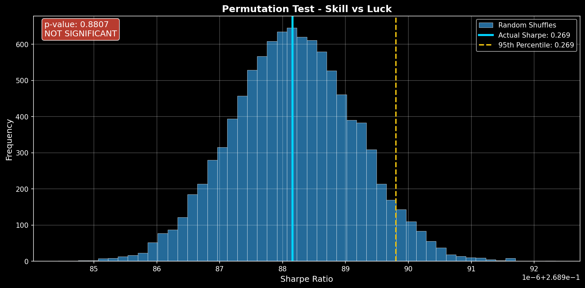
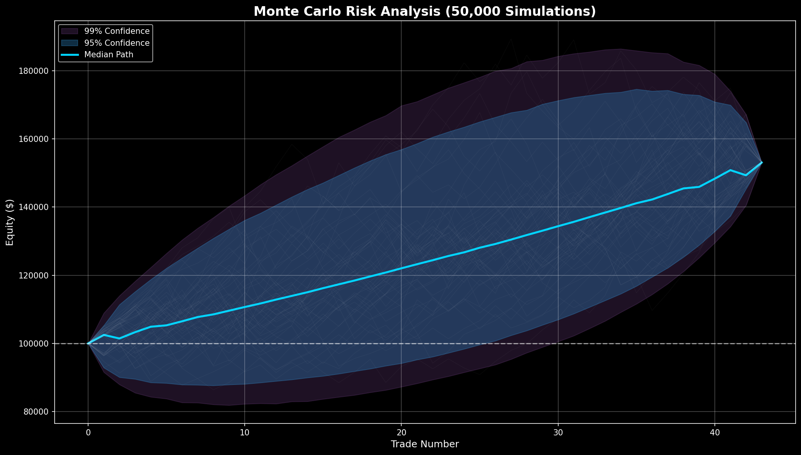
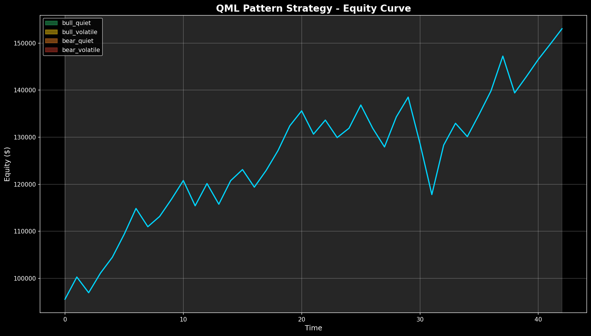

# Strategy Autopsy Report

## QML Pattern Strategy

**Date:** January 04, 2026  
**Git Hash:** 102fda3  
**Run ID:** 20260104_111627_dc363a04

---

# Executive Summary

| Metric | Value | Status |
|--------|-------|--------|
| **VERDICT** | **CAUTION** | ⚠️ |
| **Confidence Score** | 60/100 | MODERATE Confidence |
| **Total Trades** | 43 | ❌ |
| **Win Rate** | 67.4% | ✅ |
| **Sharpe Ratio** | 4.321 | ✅ |
| **Max Drawdown** | 14.9% | ✅ |
| **p-value** | 0.8807 | ❌ Not Significant |

---

# The Five Critical Questions

## 1. Is the Edge REAL?

### Statistical Significance Analysis

**Verdict: NOT SIGNIFICANT**

Cannot distinguish performance from random chance. Insufficient evidence of edge.

| Test | Result | Interpretation |
|------|--------|----------------|
| **Permutation Test** | p = 0.8807 | Only 11.9% of random orderings produced worse results. |
| **Actual Sharpe** | 0.2690 | vs. 10,000 random orderings |
| **Percentile Rank** | 11.9% | Higher = better than random |

### Bootstrap Confidence Intervals (95%)

| Metric | Lower Bound | Point Estimate | Upper Bound |
|--------|-------------|----------------|-------------|
| **Sharpe Ratio** | 0.857 | 4.321 | 8.882 |
| **Win Rate** | 58.1% | 67.4% | 76.7% |

**Interpretation:** 95% confident that true Sharpe is positive.

---

## 2. WHY Does the Edge Work?

### Trade-Level Analysis

| Statistic | Value | Interpretation |
|-----------|-------|----------------|
| **Average Win** | 3.60% | Size of typical winning trade |
| **Average Loss** | -4.16% | Size of typical losing trade |
| **Profit Factor** | 1.79 | Gross profits / Gross losses |
| **Win/Loss Ratio** | 0.86 | Reward-to-risk ratio |

### Edge Explanation

The strategy does not show statistically significant edge.

**Primary Driver:** Results cannot be distinguished from chance

---

## 3. Will the Edge CONTINUE?

### Forward-Looking Risk Assessment

| Scenario | Probability | Impact |
|----------|-------------|--------|
| **Median Outcome** | 50% | +53.0% return |
| **Bad Outcome (95% VaR)** | 5% | Up to 22.9% drawdown |
| **Worst Case (99% VaR)** | 1% | Up to 27.0% drawdown |
| **Kill Switch Trigger** | 13.1% | >20% drawdown |

**Recovery Analysis:**
- Mean time to recovery: **7.0 trades**
- 95th percentile recovery: **15.0 trades**

---

## 4. How Can It FAIL?

### Risk Scenarios

| Failure Mode | Probability | Mitigation |
|--------------|-------------|------------|
| **Random Variance** | 88.1% | HIGH - Need more data |
| **Severe Drawdown** | 13.1% | Acceptable |
| **Regime Change** | Unknown | Monitor performance by market condition |

### Worst Case Scenarios (Monte Carlo)

From 50,000 simulated paths:
- **1% of paths** result in losses of **53.0% or worse**
- **Expected shortfall** in worst 5% of cases: **25.4%**

---

## 5. How Should We TRADE It?

### Position Sizing Recommendations

Based on Monte Carlo VaR analysis:

| Risk Tolerance | Max Position Size | Rationale |
|----------------|-------------------|-----------|
| **Conservative** | 1.9x | Survive 99% VaR with 50% margin |
| **Moderate** | 3.7x | Stay within 99% VaR |
| **Aggressive** | 4.4x | Accept 95% VaR |

### Recommended Configuration

| Parameter | Value | Rationale |
|-----------|-------|-----------|
| **Risk per Trade** | 0.5-1.0% | Based on VaR/recovery analysis |
| **Max Drawdown Limit** | 20% | Kill switch threshold |
| **Min Win Rate for Confidence** | 58.1% | Lower bound of CI |

---

# Deployment Readiness

## Final Checklist

| Check | Threshold | Actual | Status |
|-------|-----------|--------|--------|
| Minimum Trade Count | ≥ 50 | 43 | ❌ FAIL |
| Statistical Significance | p < 0.05 | p = 0.8807 | ❌ FAIL |
| Minimum Sharpe Ratio | ≥ 1.0 | 4.321 | ✅ PASS |
| Ruin Probability | < 15% | 13.1% | ✅ PASS |
| Maximum Drawdown | < 25% | 14.9% | ✅ PASS |

**Result: 3/5 checks passed (60%)**

---

# Visual Analysis

## Equity Performance

## Drawdown Profile

---

# Final Verdict

# CAUTION

### ⚠️ PROCEED WITH CAUTION

The strategy shows promise but has concerns requiring attention.

**Issues to Address:**
- Consider gathering more trade data
- Validate with paper trading before live deployment
- Use reduced position sizing initially

**Recommended Next Steps:**
1. Extended paper trading period (4-8 weeks)
2. Conservative position sizing (0.25-0.5% risk)
3. Close monitoring of key metrics

---

# Appendix: Technical Configuration

## Validation Parameters

| Parameter | Value |
|-----------|-------|
| Permutation Tests | 10,000 shuffles |
| Monte Carlo Simulations | 50,000 paths |
| Bootstrap Samples | 5,000 |
| Block Size | 5 |
| Confidence Level | 95% |
| Kill Switch Threshold | 20% |
| Initial Capital | $100,000 |

## Files Generated

- `autopsy_report.md` - This report
- `charts/01_equity_curve.png` - Equity performance
- `charts/02_monte_carlo_cones.png` - Risk simulation
- `charts/03_drawdown_analysis.png` - Drawdown profile
- `charts/04_permutation_test.png` - Statistical significance

---

*Report generated on 2026-01-04 11:16:27*  
*VRD 2.0 Strategy Autopsy Framework*
