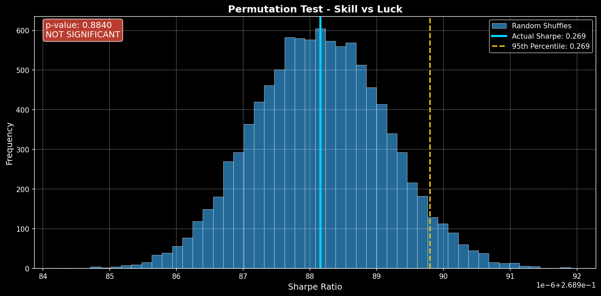
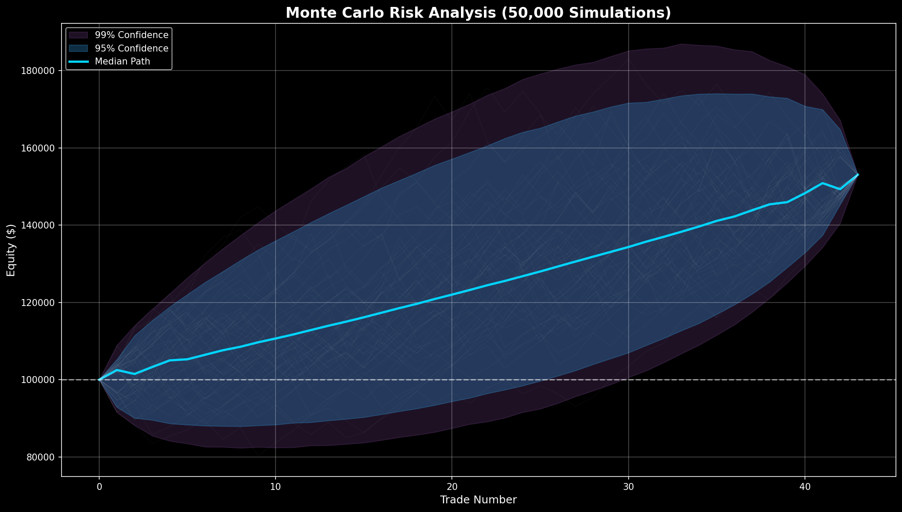

# QML Pattern Strategy Validation Report

**Date:** January 04, 2026  
**Purpose:** Comprehensive institutional-grade strategy validation

---

## Executive Summary

| Metric | Value | Assessment |
|--------|-------|------------|
| **Total Trades** | 43 | ❌ Insufficient (<50) |
| **Win Rate** | 67.4% | ✅ Strong |
| **Sharpe Ratio** | 4.321 | ✅ Good |
| **Max Drawdown** | 14.9% | ✅ Acceptable |
| **p-value** | 0.8840 | ❌ Not Significant |

# ⚠️ VERDICT: CAUTION

**Confidence Score:** 50/100

---

## Statistical Significance Analysis

### Permutation Test Results

The permutation test shuffles trade sequence 10,000 times to determine if results are due to skill or luck.

| Metric | Value | Interpretation |
|--------|-------|----------------|
| **Actual Sharpe** | 0.2690 | Strategy's realized risk-adjusted return |
| **p-value** | 0.8840 | Probability of random chance |
| **Percentile** | 11.6% | Rank vs random orderings |

**Interpretation:**
❌ **NOT SIGNIFICANT** - Cannot distinguish from random chance (p ≥ 0.05)

### Bootstrap Confidence Intervals (95%)

| Metric | Lower Bound | Upper Bound |
|--------|-------------|-------------|
| **Sharpe Ratio** | 0.963 | 8.834 |
| **Win Rate** | 58.1% | 74.4% |

---

## Monte Carlo Risk Analysis

### Simulation Results (50,000 paths)

By randomly reordering trades, we estimate the range of possible outcomes.

| Risk Metric | Value | Description |
|-------------|-------|-------------|
| **VaR 95%** | 22.98% | 95% of paths have max DD below this |
| **VaR 99%** | 26.82% | 99% of paths have max DD below this |
| **Expected Shortfall** | 25.30% | Average DD in worst 5% of cases |
| **Kill Switch Prob** | 13.3% | Probability of 20%+ drawdown |
| **Median Final Return** | +53.0% | Typical outcome |

### Risk Assessment

✅ **LOW RISK** - Kill switch probability below 15%

---

## Performance Analysis

### Equity Curve

### Drawdown Profile

| Metric | Value |
|--------|-------|
| **Maximum Drawdown** | 14.95% |
| **Recovery Time (avg)** | 7.0 trades |
| **Recovery Time (95%)** | 15.0 trades |

---

## Trade Statistics

| Statistic | Value |
|-----------|-------|
| **Total Trades** | 43 |
| **Winning Trades** | 29 |
| **Losing Trades** | 14 |
| **Win Rate** | 67.4% |
| **Profit Factor** | 1.79 |
| **Avg Win** | 3.60% |
| **Avg Loss** | -4.16% |

---

## Final Recommendations

### ⚠️ PROCEED WITH CAUTION

The strategy shows promise but has some concerns:

**Issues Identified:**
- Statistical significance borderline or insufficient trades
- Consider gathering more data before deployment

**Recommended Next Steps:**
1. Extend backtest period for more trades
2. Paper trade to validate in real-time
3. Deploy with reduced position sizing (0.25-0.5% risk)

---

## Appendix: Technical Details

### Validation Configuration
- **Permutation Tests:** 10,000 shuffles
- **Monte Carlo Simulations:** 50,000 paths
- **Bootstrap Samples:** 5,000 (block size: 5)
- **Confidence Level:** 95%
- **Kill Switch Threshold:** 20%

### Files Generated
- `professional_report.md` - This report
- `charts/equity_curve.png` - Equity performance
- `charts/monte_carlo_cones.png` - Risk simulation
- `charts/drawdown_analysis.png` - Drawdown profile
- `charts/permutation_test.png` - Statistical significance

---

*Report generated on 2026-01-04 10:53:28*
